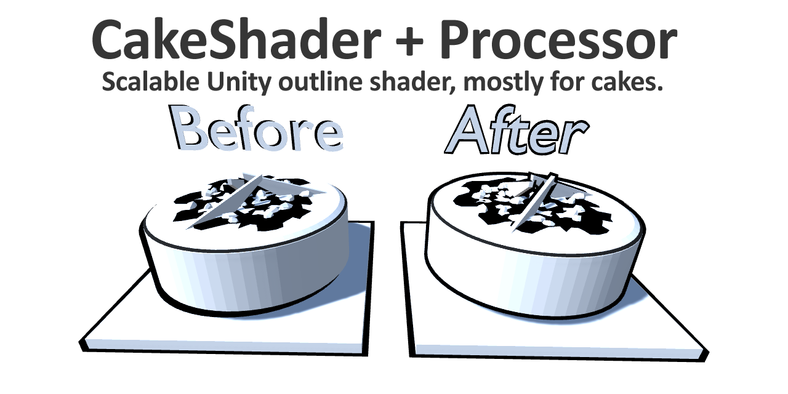

# CakeShader: A scalable Unity outline shader.
	
	Proof of concept code using outline data (vertex normals) stored
	in the mesh colour channel.

	Pop a CakeMeshProcessor.cs on your GameObject and run Process via
	the context menu.
    
    
# Notes

	Project for Unity 2018.4.6
	UnityPackage for everything else
	More notes and license info in CakeMeshProcessor.cs
	

# Thanks

	Here's the original outline shader (doesn't scale, no preprocessing)
	https://github.com/Shrimpey/Outlined-Diffuse-Shader-Fixed
	